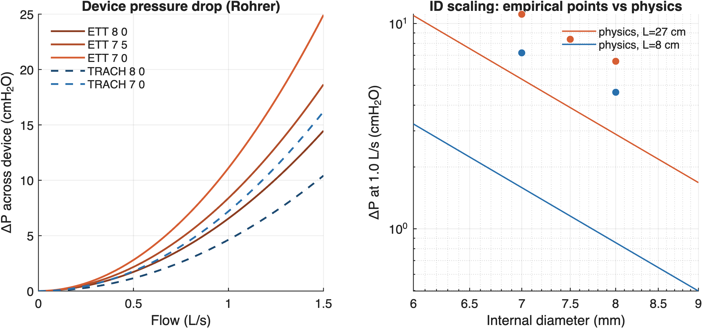
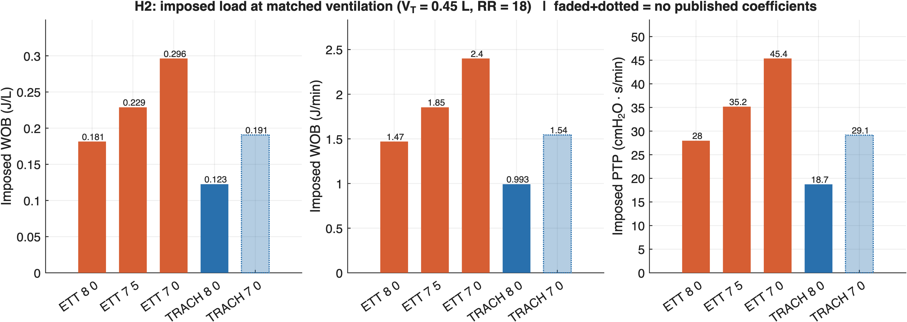
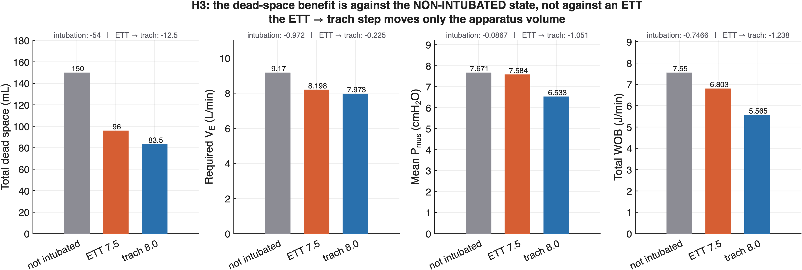
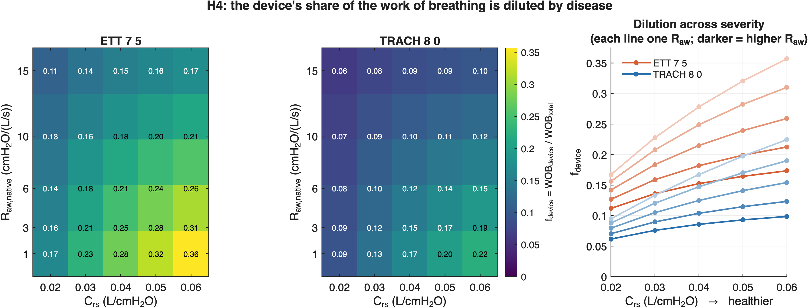
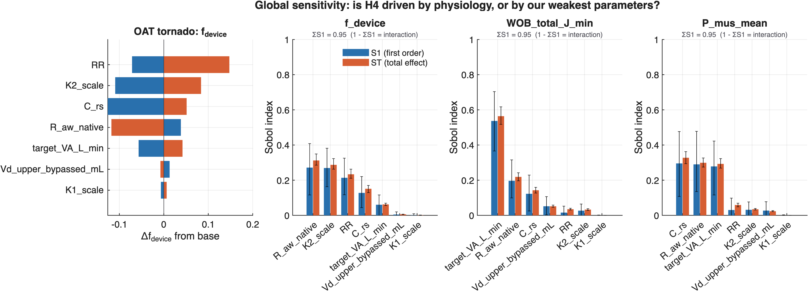

# Results — Model 1: ETT vs Tracheostomy Work of Breathing
_Auto-generated by `writeSummary.m`. Every number is recomputed at write time._

Coefficient set in use: **guttmann_within_rig**

## The one-line result

An ETT accounts for **36%** of the work of breathing in a healthy lung but only **11%** in a severe one. The device is the smallest part of the problem exactly where the problem is largest.

## H1 — device resistance

| device | ID (mm) | K1 | K2 | ΔP at 1 L/s (cmH₂O) | evidence |
|---|---|---|---|---|---|
| ETT 7 0 | 7.0 | 0.10 | 11.01 | 11.11 | B — derived here |
| ETT 7 5 | 7.5 | 0.30 | 8.09 | 8.39 | B — derived here |
| ETT 8 0 | 8.0 | 0.36 | 6.19 | 6.55 | B — derived here |
| TRACH 8 0 | 8.0 | 0.00 | 4.63 | 4.63 | B — derived here |
| TRACH 7 0 | 7.0 | 0.00 | 7.20 | 7.20 | **X — UNVERIFIED** |

At matched ID 8.0 the tracheostomy tube drops **71%** of the ETT's pressure — reproducing Guttmann's own published check of ~70%, which validates the refit end to end.

## H2 — imposed load at matched ventilation

Clinical pairing ETT 7.5 → trach 8.0, at V_T = 0.45 L and RR = 18:

| metric | ETT 7.5 | trach 8.0 | change |
|---|---|---|---|
| imposed WOB (J/L) | 0.229 | 0.123 | -46% |
| imposed WOB (J/min) | 1.85 | 0.99 | -46% |
| imposed PTP (cmH₂O·s/min) | 35.2 | 18.7 | -47% |

## H3 — dead space: the spec's mechanism does not survive

The ~72 mL upper-airway bypass is measured against the **non-intubated** state, not against an ETT. Both tubes sit with the tip in the mid-trachea and bypass the same region, so that term **cancels** from the ETT-vs-trach contrast. What remains is the apparatus volume.

| arm | dead space (mL) | required V_E (L/min) | mean P_mus (cmH₂O) | WOB (J/min) |
|---|---|---|---|---|
| not intubated | 150.0 | 9.17 | 7.67 | 7.55 |
| ETT 7.5 | 96.0 | 8.20 | 7.58 | 6.80 |
| trach 8.0 | 83.5 | 7.97 | 6.53 | 5.57 |

- dead space removed by **intubation**: 54.0 mL
- dead space removed by **ETT → trach**: 12.5 mL — only 23% of it

**External check — Chadda 2002** (PMID 12447520, the only in vivo non-intubated vs tracheostomised comparison): observed WOB ratio 1.32, model **1.36** (3% difference); observed ΔV_D 74 mL, model 66 mL.

**Also consistent with the negative studies.** Mohr 2001 (n=42, V_D/V_T 0.51→0.51) and Joseph 2013 (n=24, 41% vs 40%, p=0.75, titled *"the myth of dead space"*) measured no dead-space change after tracheostomy in already-intubated patients. The model predicts that null. It is a validation, not a contradiction — those studies compare ETT→trach, so they test the apparatus term only.

## H4 — the dilution (thesis figure)

`f_device = WOB_device / WOB_total` for ETT 7.5:

| R_aw \ C_rs | 0.02 | 0.03 | 0.04 | 0.05 | 0.06 |
|---|---|---|---|---|---|
| **1** | 0.167 | 0.228 | 0.278 | 0.321 | 0.357 |
| **3** | 0.156 | 0.208 | 0.249 | 0.282 | 0.310 |
| **6** | 0.142 | 0.183 | 0.215 | 0.239 | 0.259 |
| **10** | 0.127 | 0.159 | 0.182 | 0.199 | 0.212 |
| **15** | 0.112 | 0.136 | 0.152 | 0.164 | 0.173 |

Monotone in both directions across the whole grid: f_device falls as R_aw rises and as C_rs falls. Range **0.112 – 0.357**.

## Sensitivity — does the conclusion rest on the numbers we could not pin down?

| parameter | S1 | ST |
|---|---|---|
| R\_aw\_native | 0.272 | 0.312 |
| K2\_scale | 0.269 | 0.287 |
| RR | 0.214 | 0.234 |
| C\_rs | 0.128 | 0.151 |
| target\_VA\_L\_min | 0.061 | 0.062 |
| Vd\_upper\_bypassed\_mL | 0.005 | 0.006 |
| K1\_scale | 0.001 | 0.001 |

- **ΔV_D: ST = 0.006 — negligible.** The parameter with the weakest evidence in the model (n=6 cadavers) drives nothing, independently confirming the cancellation above.
- **K1: ST = 0.001 — negligible.** Matches both bench papers, which say a linear term is physically unnecessary.
- **K2: ST = 0.287 — second largest. Stated plainly:** the *magnitude* of f_device is materially sensitive to a grade-B refit, so no single value should be quoted as precise. What survives is the trend (monotone across the entire grid) and the order of magnitude (swapping the whole coefficient set moves f_device by ~0.01).

## Parameters still marked TODO-verify

| parameter | value | status |
|---|---|---|
| C\_rs | — | TODO-verify |
| R\_aw\_native | — | TODO-verify |
| inertance | — | TODO-verify |
| TRACH_7_0 K2 | 7.2 | **UNVERIFIED** — no published Rohrer coefficients exist for a bare 7.0 tracheostomy tube; extrapolated beyond Guttmann's measured range. Excluded from primary conclusions. |

Full provenance and evidence grades: [docs/CALIBRATION.md](../docs/CALIBRATION.md)
