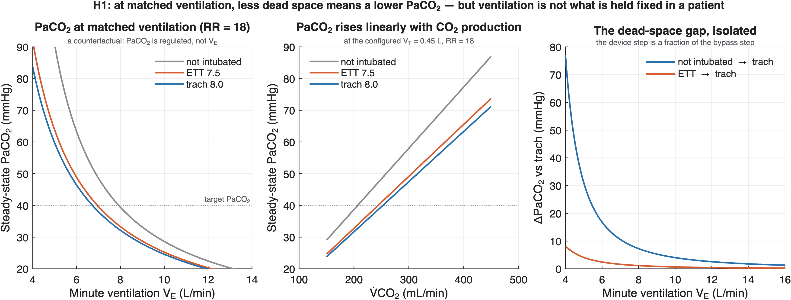
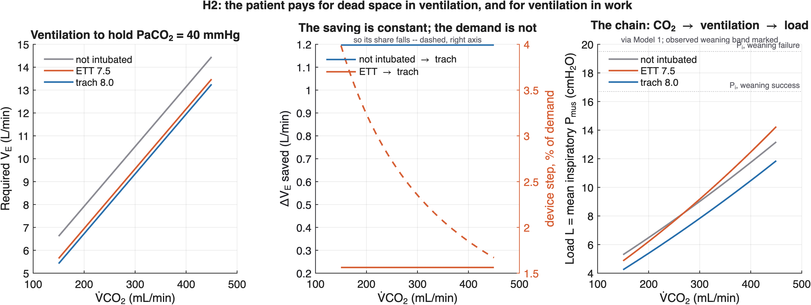
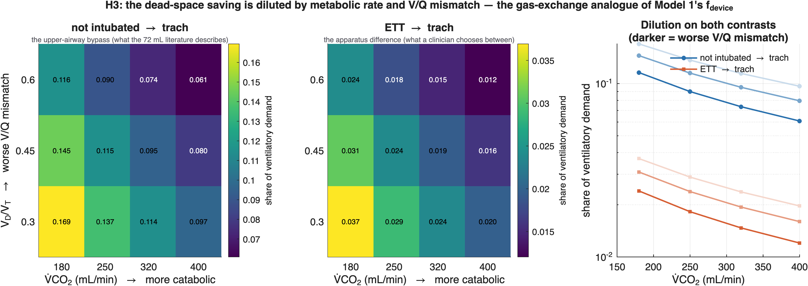
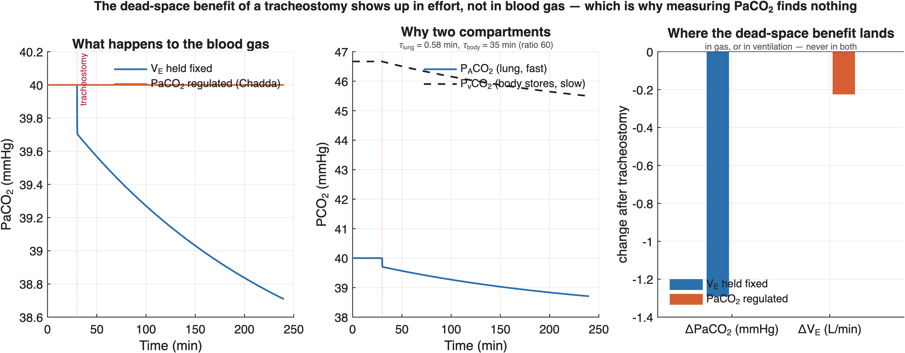

# Results — Model 1b: CO₂ Kinetics and Ventilatory Demand
_Auto-generated by `writeSummary.m`. Every number is recomputed at write time._

## The one-line result

Swapping an ETT for a tracheostomy saves **0.22 L/min** of ventilation — **3.7%** of demand in the mildest case and **1.2%** in the sickest. The gas-exchange axis says what the mechanical axis said: the device moves little, and least where disease is worst.

## What this model adds to Model 1

Model 1 has SERIES dead space only (anatomic + apparatus). This model adds the **alveolar** dead space of V/Q mismatch — the part that rises with lung injury and that a V_D/V_T of 0.6 is actually measuring — and derives the required ventilation from CO₂ production instead of taking it as a configured target.

The series term is **not recomputed here**: `co2.deadSpaceTotal` calls Model 1's `wob.deadSpace`. The spec (§8) requires ΔV_D to be single-sourced; calling Model 1's function is the only way that stays true as either model changes, and it inherits Model 1's correction that the upper-airway bypass cancels between ETT and trach.

### It closes Model 1's largest open assumption

Model 1 carried `target_VA` as a hand derivation, and Sobol ranks it the **single largest driver of total load** (ST = 0.56). This model computes it: at VCO₂ = 300 mL/min and PaCO₂ = 40, V_A = **6.47 L/min** (Model 1 config: 6.47). The earlier estimate of 6.3 was 2.7% low. `tests/tModel1b.m` asserts the two do not drift apart.

## H1 — steady-state PaCO₂ (a counterfactual, and labelled as one)

| arm | dead space (mL) | series | alveolar | V_T (L) | V_E | PaCO₂ |
|---|---|---|---|---|---|---|
| not intubated | 202.1 | 150.0 | 52.1 | 0.450 | 8.10 | 38.7 |
| ETT 7.5 | 157.5 | 96.0 | 61.5 | 0.450 | 8.10 | 32.8 |
| trach 8.0 | 147.2 | 83.5 | 63.7 | 0.450 | 8.10 | 31.7 |

- PaCO₂ gap, not intubated → trach: **7.02 mmHg**
- PaCO₂ gap, ETT → trach: **1.12 mmHg** — the device step

> **This is the mechanism with the controller switched off.** "At matched V_E the tracheostomy gives a lower PaCO₂" is true of the alveolar gas equation and is not what happens to a patient. Chadda 2002 measured both states in the same subjects: removing 74 mL of dead space left PaCO₂ and respiratory rate **unchanged** and raised V_T from 330 to 400 mL. PaCO₂ is regulated; ventilation is the response.

## H2 — required ventilation, and what it costs

The chain runs end to end: CO₂ kinetics set V_E, Model 1 turns V_E into effort, Model 2 takes the effort as load.

## H3 — the dilution (thesis figure)

The spec's H3 would, read as ETT→trach, be measuring the apparatus term and restating Model 1's finding. It is redefined as the **CO₂-side dilution**: how the ventilatory saving's share shrinks as CO₂ production and V/Q mismatch rise. That is the gas-exchange analogue of Model 1's `f_device`, on a genuinely new axis.

Share of ventilatory demand attributable to the dead-space saving:

| contrast | mildest (VCO₂ 180, V_D/V_T 0.30) | sickest (VCO₂ 400, V_D/V_T 0.60) |
|---|---|---|
| not intubated → trach | 16.9% | 6.1% |
| **ETT → trach** | **3.7%** | **1.2%** |

Both contrasts fall monotonically in both directions. The device step is only **19%** of the bypass step — the 72 mL literature is about the wrong comparison for a clinician already holding an ETT.

## The transient — and why the negative studies found nothing

What happens after tracheostomy depends entirely on what the patient does with the ventilation that dead space just freed:

| assumption | PaCO₂ | V_E |
|---|---|---|
| V_E held fixed | falls ~1.3 mmHg | unchanged |
| **PaCO₂ regulated (Chadda)** | **unchanged** | **falls ~0.22 L/min** |

**The dead-space benefit shows up in effort, not in blood gas.** So a study looking for it in PaCO₂ or V_D/V_T finds nothing — and that absence is not evidence the benefit is absent. It is the same reading that reconciles Mohr 2001 and Joseph 2013 with the model.

**Why two compartments.** The lung equilibrates in ~35 s but the body CO₂ stores take ~35 min, so the half-time to the new PaCO₂ steady state is ~55 min. A single-compartment model would report ~0.4 min — wrong by two orders of magnitude.

## Load is a product, not a sum

Raising metabolism alone does not create a failing patient: in near-normal mechanics (C_rs = 0.05, R_aw = 3) the ETT load peaks at ~14 cmH₂O even at VCO₂ = 450, below the observed weaning-failure value of 19.5. With severe mechanics (C_rs = 0.02, R_aw = 15) it reaches 19.5 at VCO₂ = 250. **Neither axis alone gets there** — which is why Model 1 needed metabolic rate added to its severity grid, and why that grid is now three-dimensional.

## Deviations from the Model 1b spec

| # | Spec said | Model does | Why |
|---|---|---|---|
| 1 | `V_D_total = V_D_phys + V_D_app − ΔV_D_bypassed(device)` | series from Model 1, bypass cancels | Both tubes bypass the same airway (Model 1, CALIBRATION.md §1.2). Read as written, H3 would restate Model 1 rather than extend it. |
| 2 | alveolar dead space implicitly ∝ V_T | **∝ (V_T − V_D_series)** | As a fraction of V_T, `V_E = V_A_req/(1 − V_D/V_T)` contains **no device term at all** — swapping the tube would have exactly zero effect and H3 would be vacuous. Regression-tested. |
| 3 | `S_body: 15.0` (no unit) | **15 mL/(kg·mmHg)** | Read as an absolute capacitance it gives a 0.5 min body time constant, contradicting the spec's own §2.1 ("large → slow, minutes to hours") and the reason for having two compartments at all. Per-kg gives ~35 min. |
| 4 | H1 stated as a prediction | **labelled a counterfactual** | Chadda measured PaCO₂ **unchanged**; the patient re-regulates. H2 is the clinical prediction. |

## Outstanding

- `S_body`, `diss_slope`, `diss_intercept` — TODO-verify; order-of-magnitude only. Affect the transient, not H1–H3.
- `VCO2` and `V_D/V_T` ranges are grade C (textbook physiology), not independently verified.
- The CO₂ dissociation curve is linearised; `co2.twoCompartment` exposes the interface for replacing it.

Full provenance: [docs/CALIBRATION.md](../docs/CALIBRATION.md)
