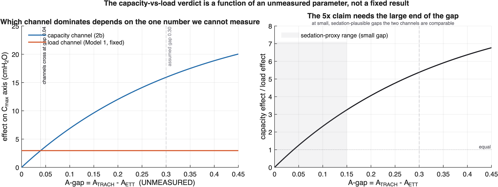

# Results — Model 2b: VIDD Capacity Dynamics
_Auto-generated by `writeSummary.m`. Every number is recomputed at write time._

## The result, and the honest boundary around it

Model 2b makes Model 2's capacity ceiling C_max endogenous: how a patient is ventilated moves the diaphragm activity A, which moves the capacity the weaning fold is defined against. Put in the same units as the load axis, the tracheostomy's effect on capacity **can exceed** its effect on breathing load — but only if it raises activity, and by how much is the one number nobody has measured.

## Two spec hypotheses the literature overturned

| # | Spec said | Data say | Source |
|---|---|---|---|
| H3 | disease catabolism is an activity-independent drain no strategy can rescue | sepsis is a REVERSIBLE starting offset; septic diaphragm force **rose 19%** over 4 d while ventilated | Lecronier 2022 PMID 35403916; Demoule 2013 PMID 23641946 |
| U-shape | degradation g(A) is U-shaped (both extremes worsen atrophy) | atrophy RATE is **monotonic** in support; the U exists only in clinical OUTCOME, not in dC/dt | Zambon 2016 PMID 26992064 vs Goligher 2018 PMID 28930478 |

Both spec versions are retained as switchable modes (`g_mode`, `d_mode`) so the contrast is a result, not a silent choice.

## Calibration

| parameter | value | basis |
|---|---|---|
| k_deg | 0.0640 /day | **anchored** — Jaber 2010 (PMID 20813887): twitch pressure −32% at 6 d |
| g_min, p_mono | 0.000, 1.384 | **solved** — Zambon 2016's atrophy rates by mode |
| k_syn | 0.2823 /day | **solved** — Lecronier 2022 two-group relaxation |

**Three independent checks land.** Jaber (not used to fit anything but the rate) is reproduced: model 31% loss at 6 d vs measured 32%. The Lecronier two-group solve implies a sepsis offset of 33%, against Demoule's independent 36% — agreeing to 3.0 percentage points. Timescale separation from Model 2 is 14–46×, so the quasi-static coupling holds.

**Levine 2008 was deliberately NOT used** — its 18–69 h window implies a rate 4–17× every other study. It was the obvious anchor and it would have been wrong by an order of magnitude.

## The capstone caveat: one unmeasured number carries the result

The tracheostomy's capacity effect versus its load effect depends entirely on the ETT→trach increase in diaphragm activity (the "A-gap"). That number has **never been measured**: no study measures diaphragm activity across the ETT-vs-tracheostomy contrast. What IS supported, at RCT grade, is that tracheostomy reduces SEDATION (TracMan 5 vs 8 sedation-days; Meng meta WMD −6 d) — the direction of the A change, not its magnitude.

| A-gap | capacity/load ratio | interpretation |
|---|---|---|
| ~0.04 | 1.0 | the two channels are equal |
| 0.10 (small, sedation-plausible) | 2.3× | capacity already comparable-to-larger |
| 0.30 (the assumed doubling) | 5.4× | the headline "5× larger" figure |

**The robust statement:** the capacity channel overtakes the load channel above an A-gap of only ~0.04, so a large doubling is NOT required for capacity to matter as much as load — any modest, RCT-supported increase in activity suffices. The specific "5×" needs the large end of the gap and should be reported as an upper bound, not a point estimate.

## What this does to the programme's thesis

If capacity is reversible and activity-sensitive (Lecronier) and the device acts on it at least as much as on load, then the weaning–survival paradox cannot be explained by "capacity is beyond rescue". The explanation shifts to what the other models already show: the load-axis rescue window is narrow (Model 2), the capacity-axis benefit depends on sedation practice actually changing (this model's open question), and any benefit competes against the device's costs (Model 3) and against competing causes of death. That is a sharper and more testable account than the spec's original one.

## Figures

| file | shows |
|---|---|
| `fig_vidd_shape.png` | H1 — capacity vs activity, monotonic vs U, and the shape-is-g test |
| `fig_vidd_trajectory.png` | H2 — capacity trajectories by strategy, Jaber anchor, reversibility |
| `fig_vidd_catabolic.png` | H3 — sepsis as reversible offset (data) vs drain (spec) |
| **`fig_vidd_dynamic_rescue.png`** | **H4 — the device on both axes over time (capstone)** |
| `fig_vidd_Agap.png` | the unmeasured A-gap, stress-tested |

## Outstanding

- **The A-gap is the critical unmeasured parameter.** Diaphragm activity has never been measured ETT vs trach. This is the single most valuable future measurement for the programme.
- C ∝ cross-sectional area, and twitch-pressure rates transferred to the MIP scale as fractional changes — both declared assumptions, neither demonstrated for the diaphragm in vivo (Yamada 2024 is contrary).
- The support→A mapping is uncalibrated; where each scenario sits on the A axis inherits it.

Full provenance: [docs/CALIBRATION.md](../docs/CALIBRATION.md)
