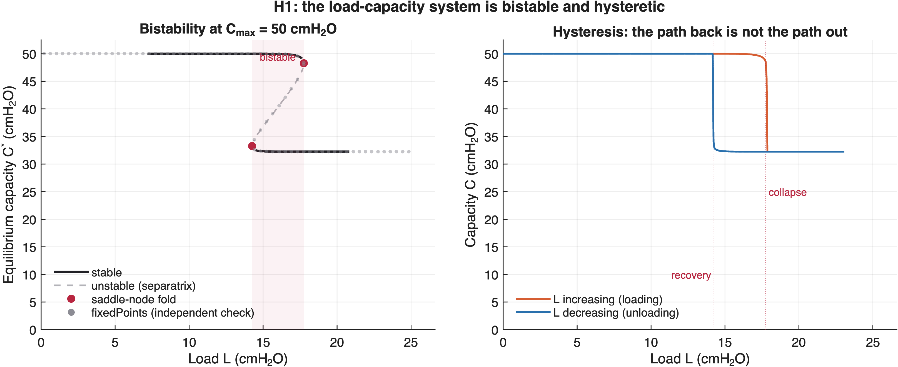
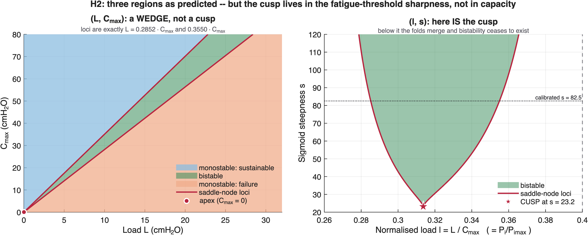
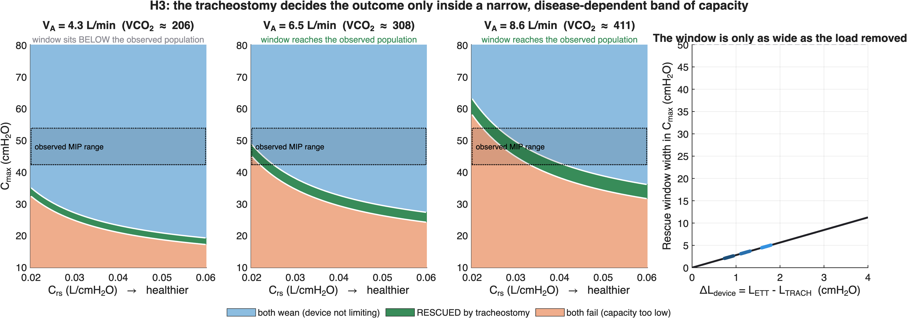
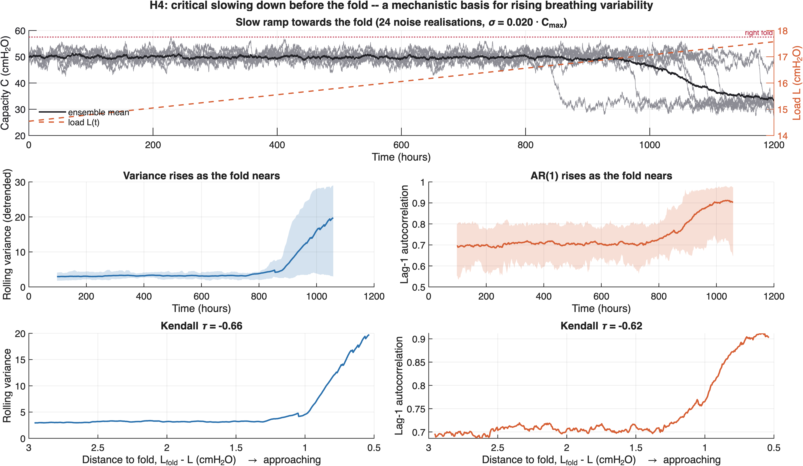
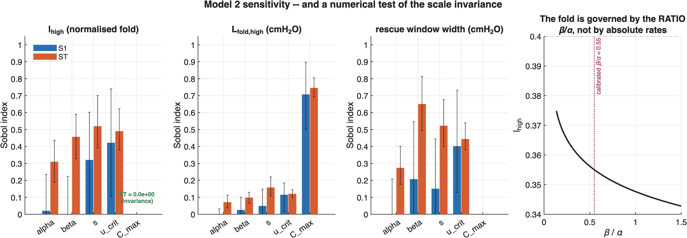

# Results — Model 2: Weaning as a Saddle-Node Bifurcation
_Auto-generated by `writeSummary.m`. Every number is recomputed at write time._

## Calibrated parameters

| parameter | value | basis |
|---|---|---|
| α | 0.1500 /hr | Laghi 1995 (PMID 7592215), 24 h recovery |
| β | 0.0826 /hr | **solved** from Laghi's capacity drop: C_low/C_max = α/(α+β) = 0.645 |
| s | 82.54 | **solved** so the fold separates the Vassilakopoulos groups |
| u_crit | 0.40 | Roussos & Macklem 1977 (PMID 893274), Pdicrit — a **pure pressure ratio** |

> The build spec anchored `u_crit` to the tension-time index (0.15). That is invalid: TTdi carries a duty-cycle factor that `u = L/C` does not, so 0.15 understates the threshold roughly threefold. With the spec's placeholders (β=0.8, s=25) the fold sits at l_high = 0.225 and the model predicts **failure for the patients who actually weaned**.

## H1 — bistability and hysteresis

At C_max = 50 cmH₂O: folds at L = **[14.26, 17.75]** cmH₂O, hysteresis width 3.49.



## H2 — three regions, but no cusp where the spec put it

The fold loci in (L, C_max) are **exactly straight lines through the origin** (L = 0.2852·C_max and 0.3550·C_max), because the system is scale-invariant in capacity. Two lines through the origin meet only at the origin, so the bistable region is a **wedge**, not a cusp.

This matters for the argument: a cusp would mean bistability *ceases to exist* below some capacity. It does not. The tipping point persists at every capacity — only its position moves. That is why the rescue window slides rather than closing.

The real cusp lives in the fatigue-threshold sharpness: below s* ≈ 23 the folds merge. The calibrated s = 82.5 sits 3.6× above it.



## H3 — the rescue window (thesis figure)

```
sustainable branch exists  ⟺  L < l_high·C_max
tracheostomy flips outcome ⟺  L_TRACH < l_high·C_max < L_ETT
                           ⟺  C_max ∈ ( L_TRACH/l_high , L_ETT/l_high )
window width               =  ΔL_device / l_high
```

| V_A (L/min) | VCO₂ | C_rs | L_ETT | L_TRACH | ΔL | window in C_max | reaches observed MIP? |
|---|---|---|---|---|---|---|---|
| 4.3 | 206 | 0.02 | 12.43 | 11.48 | 0.94 | (32.3, 35.0) | no |
| 4.3 | 206 | 0.04 | 8.21 | 7.42 | 0.79 | (20.9, 23.1) | no |
| 4.3 | 206 | 0.06 | 6.83 | 6.09 | 0.74 | (17.2, 19.2) | no |
| 6.5 | 308 | 0.02 | 17.29 | 15.97 | 1.32 | (45.0, 48.7) | **yes** |
| 6.5 | 308 | 0.04 | 11.57 | 10.41 | 1.16 | (29.3, 32.6) | **yes** |
| 6.5 | 308 | 0.06 | 9.69 | 8.59 | 1.11 | (24.2, 27.3) | **yes** |
| 8.6 | 411 | 0.02 | 22.40 | 20.61 | 1.79 | (58.0, 63.1) | **yes** |
| 8.6 | 411 | 0.04 | 15.17 | 13.54 | 1.63 | (38.1, 42.7) | **yes** |
| 8.6 | 411 | 0.06 | 12.81 | 11.22 | 1.58 | (31.6, 36.1) | **yes** |

**Three findings that depart from the spec.**

1. **The window moves, it does not shrink.** Width = ΔL_device/l_high, and ΔL_device is near-constant across severity, so the band keeps its width (~2.1–5.0 cmH₂O) and slides upward as load rises. The spec predicted a window collapsing to nothing at low C_max; that does not happen.
2. **Metabolic rate decides whether the window is even reachable.** At a normal V_A = 4.2 L/min the model cannot reach the loads measured in failing weaning patients (Vassilakopoulos: Pi = 19.5 cmH₂O) and the window falls *below* the observed MIP range entirely — a spurious "the device never matters" result that is an artefact of assuming normal metabolism. The spec did not treat V_A as a severity axis; it is one, and Sobol ranks it the single largest driver of total load.
3. **The window is narrow wherever it sits**: mean 3.4 cmH₂O against a clinical C_max range of 20–70, i.e. **~7% of the capacity axis**.

**The paradox, quantified.** For a tracheostomy to decide a patient's outcome, that patient's capacity must land inside a band a few cmH₂O wide whose position depends on their compliance, airway resistance *and* metabolic rate — none of which is known precisely at the bedside. An unselected trial puts few patients in the window and averages to approximately nothing.



## Validation — Vassilakopoulos 1998

| group | Pi (cmH₂O) | Pimax | l = Pi/Pimax | model predicts | observed |
|---|---|---|---|---|---|
| failure | 19.5 | 42.3 | 0.460 | **fail** | fail |
| success | 16.7 | 53.8 | 0.310 | **wean** | wean |

Fold at l_high = **0.3550**, between the two groups. Discrimination reproduced: **yes**.

## H4 — critical slowing down

Variance and lag-1 autocorrelation both rise monotonically as the fold is approached, giving a mechanistic basis for rising breathing variability as a weaning-failure precursor.

> The *rate* of slowing is set by the absolute eigenvalue, hence by α, which is only semi-constrained. The qualitative rise is a robust prediction of the fold; a **lead time should not be quoted**.



## Sensitivity — and a numerical test of the scale invariance

A Sobol decomposition never sees the algebra — it only sees inputs and outputs. It finds `ST(C_max)` on the **normalised** fold = **0.0e+00** (zero, as the invariance requires) and on the **absolute** fold = **0.75** (dominant). That is a stronger check on the structural claim than re-reading the derivation.



## Caveats that belong in the manuscript

- **`s` is weakly identified.** l_high is capped by u_crit, so the reachable part of the Vassilakopoulos band is (0.310, 0.400) and the discrimination only bounds s from *below* (s > 23). The base case takes the midpoint of the reachable band; targeting the midpoint of the full band would force s ≈ 354 — an implausibly hard threshold, and an over-reading of the data.
- **`L_device = f_device × L_total` is an approximation.** f_device is a fraction of *work*; L is a *pressure*. They coincide only if the pressure components stay in fixed proportion, which they do not (resistive terms peak at peak flow, elastic at end-inspiration). Measured overstatement: ~10%. The rescue window does not use the decomposition, so its conclusions are unaffected.
- **β's calibration borrows a healthy-subject fatigue protocol.** Equating Laghi's capacity drop with the model's low attractor is an interpretation, not a measurement. It is nonetheless the only quantitative anchor available, and far better than an arbitrary value.
- **Laghi 2003 (PMID 12411288) is a direct challenge.** Weaning failure was *not* accompanied by low-frequency diaphragm fatigue: twitch Pdi was unchanged (8.9→9.4 cmH₂O), and patients were removed from the trial *before* fatigue developed — weakness, not fatigue, dominated. Confront this head-on. One defensible reading: the low branch is a state patients are removed from before reaching, so the bifurcation governs **the decision to stop**, not the physiological collapse itself.
- **Right fold vs left fold.** This model uses the *right* fold, which is the SBT question: between trials the patient is supported (L≈0) and recovers towards C_max, so each trial starts on the high branch and the question is whether it survives the load. The *left* fold governs a different, also real scenario — a patient ground down over days without full unloading. Hysteresis then says something clinically pointed: once collapsed, restoring the ETT-level load is **not enough**; the load must fall below the left fold. That is a dynamical argument for intervening early.
